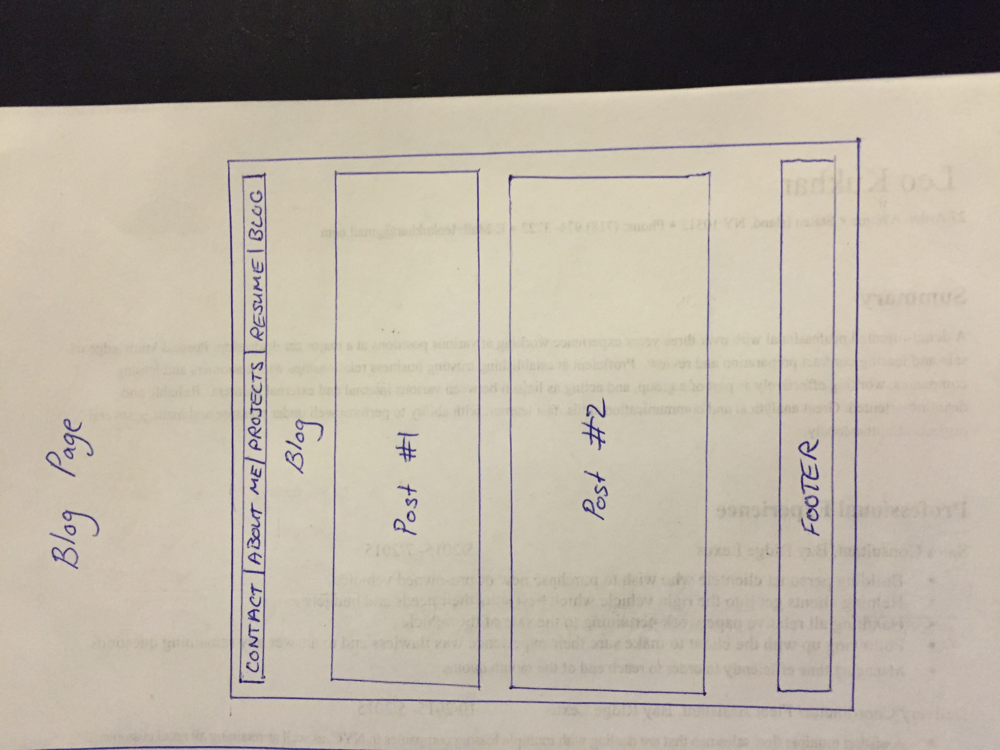
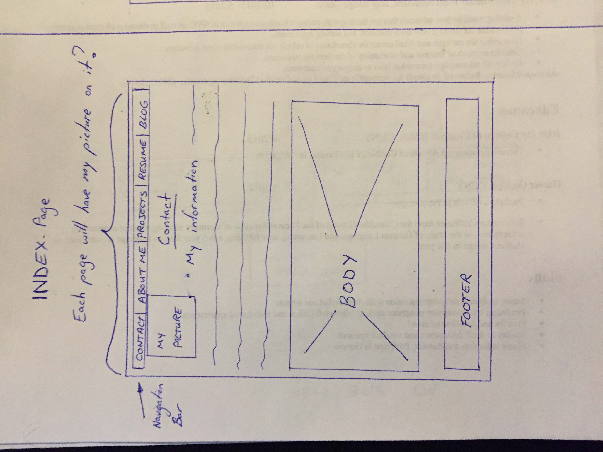

What is a wireframe?
-A wireframe is like the skeleton of a website. It is the foundation upon which content importance is laid upon. It is the visual represantation of how a website will potentially look when finished.
What are the benefits of wireframing?
- A wireframe allows you to visualize your ideas and how you want your website to look. It allows you to categorize web content in order of importance. Building a sort of hierarchy.
Did you enjoy wireframing your site?
- I did enjoy thinking of ways to create a clever layout, I did however stick withou one that I feel would be most easy to make as well as navigate.
Did you revise your wireframe or stick with your first idea?
- I did have an idea for a more complex site, but I figured that it wouldn't be too user friendly so I stuck with my original drawings.
What questions did you ask during this challenge? What resources did you find to help you answer them?
-My biggest concern again was the displaying of images in the reflection, altough this time I did find it a lot easier to display the image.
Which parts of the challenge did you enjoy and which parts did you find tedious?
- I found the adding of the images into the reflection a little tedious. However I enjoyed drawing out wireframes for my website a lot. I got to thinking very creatively in terms of what is most user friendly, which layout would be the easiest to navigate, and the over all look and feel of the website. I considered the article on the UX design, and thought more about how the website looks and feels to the user, rather than how I feel about it.
