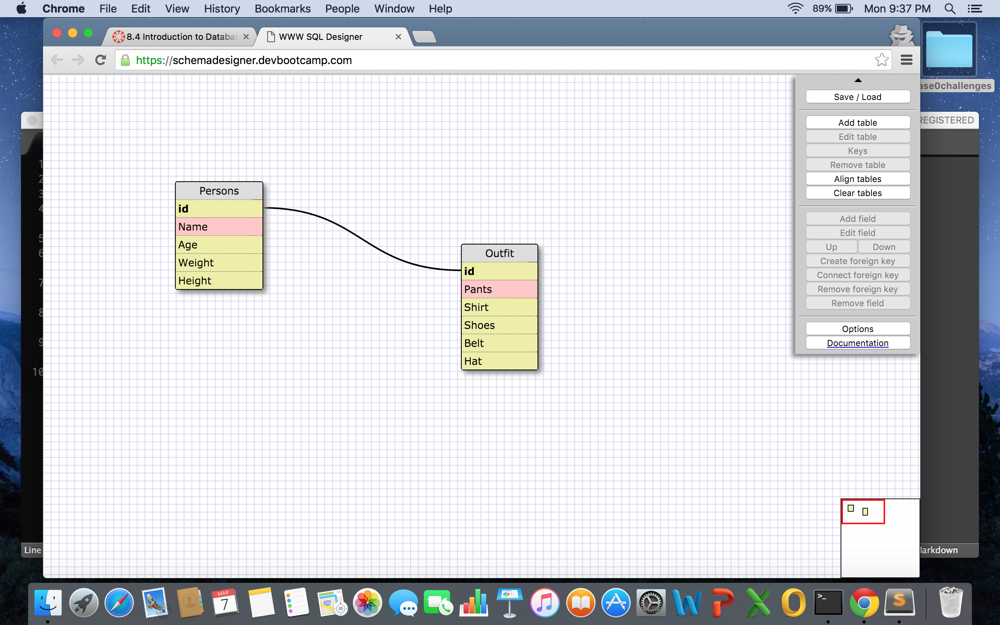

1. SELECT * FROM states;
2. SELECT * FROM regions;
3. SELECT state_name, population FROM states;
4. SELECT state_name, population FROM states ORDER BY population DESC;
5. SELECT state_name FROM states WHERE region_id = 7;
6. SELECT state_name, population_density FROM states WHERE population_density > 50 ORDER BY population_density ASC;
7. SELECT state_name FROM states  WHERE population BETWEEN  1000000 AND 1500000;
8. SELECT state_name, region_id FROM states ORDER BY region_id ASC;
SELECT region_name FROM regions WHERE region_name LIKE '%Centra%';
SELECT states.state_name FROM states INNER JOIN regions ON region_id  = states.region_id ORDER BY region_id ASC;

What are databases for?
- Databases are used to story information and its relations to other things in the form of tables. Sort of like key value pairs but with multiple keys and values.

What is a one-to-many relationship?
- A one to many relationship is something like a multi-dimensional hash. Where one key has values which are keys for further values.

What is a primary key? What is a foreign key? How can you determine which is which?
- A primary key is one that is doing the linking to a table, a foreign key is one that is being linked too. You can tell by looking at a databases schema.

How can you select information out of a SQL database?
- By using the SELECT keyword and specifying the thing or things you are looking for.

What are some general guidelines for that?
- Key words always come capitalized; altough not necessary, it is considered best practice. When querying a database, the SELECT keyword always comes first.
